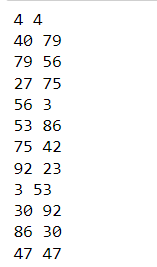

## РОССИЙСКИЙ УНИВЕРСИТЕТ ДРУЖБЫ НАРОДОВ

### Факультет физико-математических и естественных наук

### Кафедра прикладной информатики и теории вероятностей

#### ОТЧЕТ ПО

#### ЛАБОРАТОРНОЙ РАБОТЕ №7

***дисциплина: Математические основы защиты информации и информационной безопасности***

Студент: Хиссен Али Уэддей\
Группа: НПМмд-02-20\
Ст. билет № 1032209306

## Цель работы


Цель работы
Изучить алгоитм реализующий P-метод Полларда для задач дискретного логорифмирования.


# Теоретические часть

### Алгоритм, реализующий р-метод Полларда.


Теоретические сведения
P-метод Полларда для задач дискретного логорифмирования
Вход: Простое число p, число а порядка r по модулю р, целое число b, 1 < b <p; отображение f, обладающее сжимающими свойствами и сохраняющее вычислимость логарифма.
Выход. Показатель x, для которого аx = b (mod p), если такой показатель существует.
1.	Выбрать произвольные целые числа u, v и положить с = а^u^.b^v^(modp), d = с.
2.	Выполнять с = f(c)(mod p), d = f(f(d))(mod p), вычисляя при этом логарифмы для с и d как линейные функции от х по модулю r, до получения равенства с = d (mod p).
3.	Приравняв логарифмы для c и d, вычислить логарифм х решением сравнения по модулю r. Результат: х или "Решений не

# програмная часть 


``` python

#definition de la fonction f
a,b,p=10,64,107
u,v=2,2


def f(c):
    
    if c<p//2 :
        
        return (a*c)%p
    
    else:
        
        return (b*c)%p
    
c=(a**u*b**v)%p
    
d=c

while(True):
    
    print (c,d)
    
    c=f(c)%p
        
        
    d=f(f(d))%p
        
    if c==d:
        
        print (c,d)
        
        break
    
    
```

**результат  при заданом некоторый аргумент**





**вывод** Мы изучали  алгоитм реализующий P-метод Полларда для задач дискретного логорифмирования  .Данная лабораторная работа нужна подправка 
